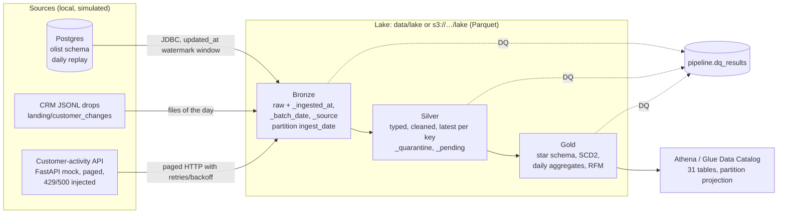
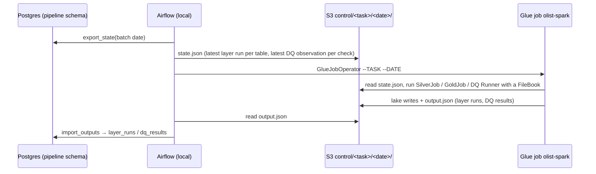

# Architecture

A daily batch pipeline over three simulated sources, with Bronze/Silver/Gold layers on Parquet,
data-quality gates after every layer, and Airflow orchestration. It runs fully locally (8 GB Mac) or with
the lake on S3 and Spark on AWS Glue (ap-southeast-2).

## Data flow



One business day = one Airflow DAG run: replay the day into the sources, ingest Bronze, check it, build
Silver, check it, build Gold, check it. `max_active_runs=1`: each day depends on the previous day's
watermarks and source state.

## Where each job runs

| Job | Local mode (`olist_daily`) | AWS mode (`olist_daily_aws`) |
|---|---|---|
| Replay into Postgres, CRM files, mock API | local | local (Postgres is not exposed to AWS; no RDS) |
| Bronze: Postgres, files, API | local Spark (`local[2]`, 2 GB driver) | local Spark, then `aws s3 sync` publish |
| DQ Bronze | local Spark | local Spark |
| Silver, DQ Silver, Gold, DQ Gold | local Spark | AWS Glue job `olist-spark` (Glue 5.0, Spark 3.5.4, Flex, 2 × G.1X) |
| Lake | `data/lake` | `s3://olist-pipeline-<account>-apse2/lake`, pulled back after each day |
| Queries | Spark | Athena (workgroup `olist`, 1 GB scan cutoff) |
| Orchestration | Airflow 3.3.2 standalone (SQLite, LocalExecutor) | same, with `GlueJobOperator` |

Why compute isn't local Spark against S3: from this laptop every S3 request to Sydney takes about 0.4 s
to connect and 1.1 s to the first byte, so a Silver day that takes under a minute locally was still running
after 51 minutes (see [DECISIONS.md](DECISIONS.md)).

### Control plane local, data plane on AWS

Glue can't reach the local Postgres that holds the bookkeeping, so each Glue step is three tasks:



`FileBook` (`olist_pipeline/control.py`) and `Bookkeeping` (`olist_pipeline/watermarks.py`) share one
interface (`last_layer_run`, `record_layer`, `previous_observed`, `record_dq`), so the Spark jobs are the
same code in both modes.

## Lake layout

```
lake/bronze/olist_postgres/<table>/ingest_date=YYYY-MM-DD/      9 tables (reference tables only when their hash changes)
lake/bronze/crm/customer_changes/ingest_date=…/
lake/bronze/api/customer_activity/ingest_date=…/
lake/silver/<table>/[<event date>=YYYY-MM-DD/]                  11 tables
lake/silver/_quarantine/<table>/batch_date=…/                   rows that can't be fixed, with _reason
lake/silver/_pending/<table>/batch_date=…/                      late-arriving children, retried for 7 days
lake/gold/dim_date | dim_product | dim_seller | dim_customer (SCD2)
lake/gold/fact_order_lines/order_purchase_date=…/
lake/gold/agg_daily_category_sales/order_purchase_date=…/
lake/gold/customer_metrics/as_of_date=…/                        RFM snapshot per batch day
```

S3 bucket (`infra/step8.yaml`, all tagged `project=olist-pipeline`): `lake/`, `landing/` (Glacier IR after
90 days), `athena-results/` (expire after 7 days), `glue/` (wheel, entry script, DQ suites), `control/`
(Glue state and outputs), `experiments/`. Private, SSE-S3, versioned (noncurrent versions expire after 7
days), TLS-only.

## Bookkeeping (Postgres schema `pipeline`)

| Table | Written by | Used for |
|---|---|---|
| `watermarks` | Bronze from Postgres | high watermark of `updated_at` per table |
| `ingest_runs` | every Bronze job | the window `(low, high]` and row count per table and batch date; a rerun of D reuses D's window |
| `reference_snapshots` | Bronze reference tables | content hash per snapshot: a new snapshot only when the data changed |
| `layer_runs` | Silver, Gold | the Bronze ingest range each batch processed, row accounting (in = valid + quarantined + duplicate + pending), details |
| `dq_results` | DQ runner | one row per check and batch: status, failed rows, observed value, sample |

## Data quality

Declarative YAML suites per layer (`config/dq/`): 32 Bronze, 47 Silver and 31 Gold checks
(not_null, unique, accepted_values, range, schema, relationship, row_count_vs_previous, expression), in
batch, table or latest scope. Severity `error` blocks the DAG (exit 1); `warn` is recorded only.

## Security

- No credentials in git or config. Spark and boto3 use the default AWS credential chain (local profile;
  an IAM role on Glue). The Postgres password and API key live in Secrets Manager (`olist/pipeline`) for
  the AWS target and are masked in config dumps.
- The account id is never committed or printed: the bucket name is built at run time and masked in output.
- The Glue role can read only this bucket's `lake/`, `glue/`, `control/` and write only `lake/` and `control/`.
